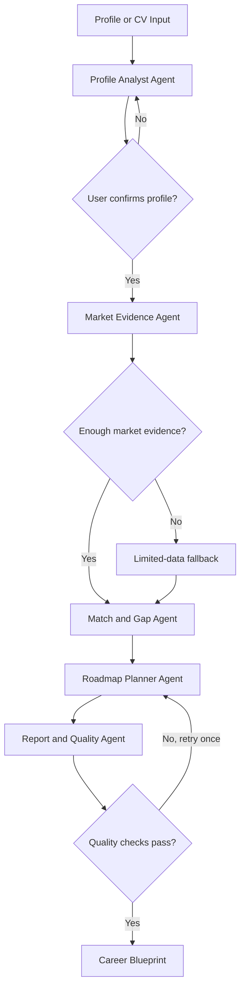

# PRD - AI Career Path Optimizer (CareerCompass)

---

| **Informasi** | **Detail** |
|---|---|
| **Versi** | 1.0 (Final) |
| **Status** | Approved for Implementation |
| **Tanggal** | 14 Juli 2026 |
| **Target pengerjaan** | 2 minggu / 10 hari kerja |
| **Platform** | Web MVP (FastAPI backend + React frontend, monorepo) |
| **Target pengguna** | Early-career professional dan career switcher di Indonesia |
| **Bahasa** | Indonesia dan Inggris |
| **Supported Roles** | Data Analyst, Business Analyst, Python Backend Developer, QA Engineer, Product Manager, Digital Marketing Specialist |

---

> **Keputusan scope:** MVP memakai dataset lowongan terkurasi/import CSV. Live scraping LinkedIn, Jobstreet, dan portal lain bukan P0 karena risiko Terms of Service, perubahan HTML, rate limit, dan ketidakstabilan demo.

---

## Daftar Isi

1. [Executive Summary & Problem Statement](#1-executive-summary--problem-statement)
2. [Latar Belakang Masalah](#2-latar-belakang-masalah)
3. [Solusi yang Diusulkan](#3-solusi-yang-diusulkan)
4. [Target Pengguna](#4-target-pengguna)
5. [Tujuan Produk](#5-tujuan-produk)
6. [Hipotesis Produk](#6-hipotesis-produk)
7. [User Stories](#7-user-stories)
8. [User Journey](#8-user-journey)
9. [Input Pengguna](#9-input-pengguna)
10. [Output Produk](#10-output-produk)
11. [Role Fit Score](#11-role-fit-score)
12. [Functional Requirements](#12-functional-requirements)
13. [Agentic Workflow](#13-agentic-workflow)
14. [Agent dan Sub-Agent](#14-agent-dan-sub-agent)
15. [MCP Tools](#15-mcp-tools)
16. [Vector Database](#16-vector-database)
17. [Base Technology](#17-base-technology)
18. [Non-Functional Requirements](#18-non-functional-requirements)
19. [Success Metrics](#19-success-metrics)
20. [Evaluation Plan](#20-evaluation-plan)
21. [Risiko dan Mitigasi](#21-risiko-dan-mitigasi)
22. [Rencana Pengerjaan Dua Minggu](#22-rencana-pengerjaan-dua-minggu)
23. [Definition of Done](#23-definition-of-done)
24. [Requirement Traceability](#24-requirement-traceability)

---

## 1. Executive Summary & Problem Statement

Banyak early-career professional dan career switcher kesulitan menentukan arah karier karena informasi pasar kerja yang tersebar dan saran AI biasa yang sering kali generik tanpa bukti data.

**CareerCompass** menyelesaikan masalah ini dengan menggabungkan ekstraksi profil pengguna, pencarian lowongan berbasis vektor (ChromaDB), kalkulasi kecocokan deterministik, dan penyusunan roadmap 30/60/90 hari dalam satu **Career Blueprint** terstruktur.

### Problem Statement

> Bagaimana membantu early-career professional dan career switcher memilih jalur karier yang realistis, berbasis bukti pasar kerja, serta mendapatkan langkah peningkatan skill yang dapat langsung dilakukan?

---

## 2. Latar Belakang Masalah

Early-career professional dan career switcher sering menghadapi beberapa masalah:

- Tidak mengetahui role yang paling sesuai dengan pengalaman dan skill saat ini.
- Informasi skill, demand, dan salary tersebar di banyak portal.
- Rekomendasi karier online sering generik dan tidak memakai data pasar kerja.
- Pengguna harus membaca banyak lowongan secara manual untuk memahami skill yang dibutuhkan.
- Pengguna mengetahui tujuan karier, tetapi tidak memiliki roadmap realistis untuk mencapainya.
- AI chatbot dapat memberi saran yang terdengar meyakinkan tanpa bukti atau sumber.

Akibatnya, pengguna dapat memilih jalur karier yang tidak sesuai, mempelajari skill yang kurang relevan, atau menetapkan target yang tidak realistis.

---

## 3. Solusi yang Diusulkan

CareerCompass menggunakan multi-agent workflow untuk mengubah profil pengguna dan data pasar kerja menjadi **Career Blueprint**.

Career Blueprint berisi:

- Ringkasan profil pengguna.
- Tiga rekomendasi role.
- Role Fit Score per rekomendasi.
- Penjelasan komponen skor.
- Skill yang sudah cocok.
- Skill gap prioritas.
- Bukti lowongan relevan.
- Indikator demand berdasarkan corpus.
- Salary benchmark jika data memadai.
- Roadmap belajar 30/60/90 hari.
- Risiko dan asumsi rekomendasi.
- Confidence level dan sumber data.

Rekomendasi merupakan **alat bantu keputusan**, bukan jaminan diterima bekerja atau prediksi pasti terhadap masa depan karier.

---

## 4. Target Pengguna

### Primary Persona

**Career Switcher**

- Memiliki pengalaman kerja 1–5 tahun.
- Ingin pindah ke bidang digital atau teknologi.
- Belum mengetahui role yang paling dekat dengan pengalaman saat ini.
- Memiliki waktu dan anggaran belajar terbatas.
- Membutuhkan roadmap konkret.

**Contoh:**
> Staf operasional dengan pengalaman dua tahun, mahir Excel dan reporting, ingin berpindah ke data tetapi belum mengetahui apakah lebih cocok menjadi Data Analyst atau Business Analyst.

### Secondary Persona

**Fresh Graduate**

- Memiliki pendidikan, proyek, atau pengalaman magang.
- Belum memahami kecocokan skill dengan role.
- Membutuhkan prioritas belajar dan bukti dari pasar kerja.

### Cakupan Role MVP

MVP hanya mendukung enam role:

1. Data Analyst
2. Business Analyst
3. Python Backend Developer
4. QA Engineer
5. Product Manager
6. Digital Marketing Specialist

Role dan industri lain menjadi pengembangan setelah MVP.

---

## 5. Tujuan Produk

### Product Goals

- Menghasilkan maksimal tiga rekomendasi role berbasis profil dan data lowongan.
- Menjelaskan alasan rekomendasi secara transparan.
- Mengurangi hallucination melalui retrieval, MCP tools, structured output, dan quality checks.
- Menghasilkan roadmap 30/60/90 hari sesuai waktu serta anggaran pengguna.
- Menampilkan sumber dan tanggal data untuk setiap klaim pasar kerja.
- Mendemonstrasikan AI agent, sub-agents, tools, MCP, vector database, dan agentic workflow.

### Non-Goals

MVP tidak mencakup:

- Melamar pekerjaan secara otomatis.
- Membuat atau mengirim CV.
- Interview simulator.
- Integrasi langsung dengan LinkedIn atau Jobstreet.
- Live scraping sebagai sumber data utama.
- Authentication dan multi-user workspace.
- Semua profesi dan industri.
- OCR untuk CV hasil scan.
- Tes kepribadian atau psikometri.
- Prediksi pasti kemungkinan diterima bekerja.
- Rekomendasi berdasarkan gender, usia, agama, etnis, status pernikahan, foto, atau atribut sensitif lain.

---

## 6. Hipotesis Produk

> Jika pengguna menerima rekomendasi jalur karier yang menggabungkan profil pribadi, bukti pasar kerja, skill gap, dan roadmap realistis, pengguna akan lebih percaya diri memilih target karier dan mengetahui tindakan berikutnya.

Hipotesis dianggap mendapat sinyal positif jika minimal empat dari lima pengguna uji:

- Menilai rekomendasi relevan minimal 4 dari 5.
- Memahami alasan rekomendasi.
- Dapat menentukan minimal satu tindakan setelah membaca report.
- Lebih memilih output ini dibanding saran chatbot generik.

---

## 7. User Stories

- Sebagai career switcher, saya ingin memasukkan pengalaman dan skill agar mengetahui role yang paling realistis.
- Sebagai pengguna, saya ingin memeriksa dan mengubah hasil ekstraksi CV agar analisis tidak memakai informasi yang salah.
- Sebagai pengguna, saya ingin melihat bukti lowongan agar memahami dasar rekomendasi.
- Sebagai pengguna, saya ingin mengetahui skill gap berdasarkan prioritas.
- Sebagai pengguna, saya ingin roadmap sesuai waktu belajar dan anggaran.
- Sebagai pengguna, saya ingin melihat confidence level ketika data tidak memadai.
- Sebagai evaluator, saya ingin melihat agent, tool call, dan alur keputusan sistem.
- Sebagai pengguna, saya ingin mengunduh Career Blueprint untuk digunakan setelah sesi selesai.

---

## 8. User Journey

1. Pengguna membuka aplikasi.
2. Pengguna mengisi profil atau mengunggah CV.
3. Sistem mengekstrak profil menjadi data terstruktur.
4. Pengguna memeriksa dan mengonfirmasi hasil ekstraksi.
5. Sistem mencari role dan lowongan relevan melalui MCP tools.
6. Sistem mengukur kecocokan profil terhadap role.
7. Sistem memilih maksimal tiga rekomendasi.
8. Sistem mengidentifikasi skill gap.
9. Sistem menyusun roadmap 30/60/90 hari.
10. Quality Agent memeriksa bukti, sumber, dan konsistensi.
11. Jika pemeriksaan gagal, report direvisi maksimal satu kali.
12. Pengguna melihat dan mengunduh Career Blueprint.

Jika data tidak memadai, sistem tetap membuat report tetapi memberikan label **Low Confidence** dan tidak membuat klaim yang tidak didukung data.

---

## 9. Input Pengguna

### Informasi Wajib

- Ringkasan pengalaman.
- Daftar skill.
- Tahun pengalaman.
- Bidang atau aktivitas yang diminati.
- Lokasi kerja yang diinginkan.
- Preferensi remote, hybrid, atau onsite.
- Waktu belajar per minggu.
- Target waktu perpindahan karier.

### Informasi Opsional

- CV berformat PDF atau TXT.
- Pendidikan.
- Portofolio atau proyek.
- Role yang ingin dibandingkan.
- Target salary.
- Anggaran belajar.
- Kendala khusus.

### Batasan CV

- Maksimal 5 MB.
- Didukung: PDF dengan selectable text, PDF hasil scan, dan TXT.
- Parsing memakai **Mistral OCR API**; bukan library lokal seperti pypdf.
- Hasil ekstraksi tetap wajib dikonfirmasi pengguna sebelum analisis dimulai.

---

## 10. Output Produk

### Career Blueprint

#### A. Profile Summary

- Pengalaman.
- Skill.
- Domain knowledge.
- Pendidikan.
- Minat.
- Kendala.

#### B. Top Career Paths

Untuk setiap role:

- Role Fit Score 0–100.
- Confidence level.
- Ringkasan kecocokan.
- Komponen skor.
- Kelebihan pengguna.
- Hambatan utama.
- Bukti lowongan relevan.

#### C. Skill Gap Matrix

| **Skill** | **Status** | **Prioritas** | **Bukti** |
|---|---|---:|---|
| SQL | Dimiliki | — | Disebut pengguna |
| Data visualization | Perlu diperkuat | Tinggi | Muncul pada 72% sample lowongan |
| Python | Belum dimiliki | Sedang | Required pada role tertentu |

#### D. Roadmap 30/60/90 Hari

Setiap aktivitas memiliki:

- Skill atau hasil yang dituju.
- Aktivitas konkret.
- Estimasi waktu.
- Learning resource.
- Deliverable atau bukti kompetensi.
- Kriteria selesai.

#### E. Market Evidence

- Jumlah lowongan yang dianalisis.
- Skill yang sering muncul.
- Lokasi dominan.
- Seniority.
- Salary range jika sample memadai.
- URL atau ID sumber.
- Tanggal pengambilan data.

#### F. Limitations

- Data yang tidak tersedia.
- Asumsi analisis.
- Faktor yang tidak dipertimbangkan.
- Alasan confidence rendah jika berlaku.

---

## 11. Role Fit Score

Skor dihitung melalui **kode deterministik**. LLM tidak boleh menentukan skor akhir secara bebas.

```text
Role Fit Score =
  40% Skill Match
  + 20% Experience and Transferable Context
  + 15% User Interest
  + 10% Work Constraints
  + 15% Market Evidence
```

### Interpretasi

| **Skor** | **Interpretasi** |
|---:|---|
| 80–100 | Strong fit |
| 65–79 | Promising fit |
| 50–64 | Possible with meaningful gaps |
| < 50 | Not recommended for current plan |

Skor merupakan alat perbandingan antar-role, bukan probabilitas diterima bekerja.

Salary tidak menjadi komponen skor karena data salary sering tidak lengkap.

---

## 12. Functional Requirements

| **ID** | **Requirement** | **Prioritas** | **Acceptance Criteria** |
|---|---|---|---|
| FR-01 | Profile input | P0 | Pengguna dapat mengisi seluruh field wajib dan menerima pesan validasi untuk input tidak lengkap. |
| FR-02 | CV extraction | P0 | Sistem dapat mengekstrak teks dari PDF/TXT dan menghasilkan structured profile. |
| FR-03 | Profile confirmation | P0 | Pengguna dapat mengubah skill, pengalaman, dan preferensi sebelum analisis. |
| FR-04 | Job retrieval | P0 | Sistem mengambil lowongan relevan dari vector DB melalui MCP tool. |
| FR-05 | Role recommendation | P0 | Sistem menghasilkan maksimal tiga role dari enam role yang didukung. |
| FR-06 | Deterministic scoring | P0 | Setiap rekomendasi memiliki total dan komponen skor yang dapat dihitung ulang. |
| FR-07 | Skill gap analysis | P0 | Report membedakan skill dimiliki, perlu ditingkatkan, dan belum dimiliki. |
| FR-08 | Market evidence | P0 | Setiap klaim demand memiliki sample count, sumber, atau internal document ID. |
| FR-09 | Learning roadmap | P0 | Setiap role memiliki roadmap 30/60/90 hari yang mengikuti waktu dan anggaran pengguna. |
| FR-10 | Confidence handling | P0 | Role dengan kurang dari lima dokumen relevan diberi label Low Confidence. |
| FR-11 | Quality validation | P0 | Report diperiksa terhadap missing citation, contradiction, dan unsupported claim. |
| FR-12 | Report export | P0 | Pengguna dapat mengunduh report dalam Markdown atau JSON. |
| FR-13 | Workflow visibility | P0 | UI menampilkan tahap workflow aktif tanpa menampilkan chain-of-thought internal. |
| FR-14 | Agent trace | P0 | Mode demo menampilkan nama agent, tool yang dipanggil, status, dan durasi. |
| FR-15 | Compare paths | P1 | Pengguna dapat membandingkan dua role dalam satu tabel. |
| FR-16 | Salary benchmark | P1 | Salary hanya ditampilkan ketika sumber dan sample data memadai. |
| FR-17 | Report history | P1 | Pengguna dapat membuka kembali report dalam sesi lokal. |

---

## 13. Agentic Workflow



Workflow bersifat agentic karena sistem:

- Memilih tools berdasarkan kebutuhan.
- Menggunakan hasil tool sebagai evidence.
- Memiliki conditional routing.
- Menangani kondisi data tidak cukup.
- Melakukan quality check.
- Melakukan revisi maksimal satu kali.

---

## 14. Agent dan Sub-Agent

### 14.1 Workflow Supervisor

**Tanggung jawab:**

- Menjalankan workflow via Python orchestrator + Agno Agent instances (lihat `TECH_STACK.md` §1.4).
- Menyimpan shared state (`TypedDict`).
- Mengatur urutan dan conditional routing.
- Menangani timeout dan retry.
- Menggabungkan output sub-agent.

Supervisor lebih banyak memakai kode deterministik daripada keputusan LLM.

### 14.2 Profile Analyst Agent

**Input:**

- Form profile.
- Teks CV.

**Output terstruktur:**

- Skill.
- Pengalaman.
- Role sebelumnya.
- Transferable skills.
- Pendidikan.
- Minat.
- Constraints.

**Guardrail:**

- Tidak menyimpulkan skill yang tidak disebut atau tidak didukung CV.
- Mengabaikan atribut sensitif.
- Meminta konfirmasi pengguna sebelum data digunakan.

### 14.3 Market Evidence Agent

**Tools:**

- `search_job_market`
- `get_role_skill_stats`
- `get_salary_benchmark`

**Tanggung jawab:**

- Mengambil lowongan relevan.
- Mencari skill yang sering muncul.
- Menilai ketersediaan evidence.
- Menyediakan source ID, URL, dan tanggal.

### 14.4 Match and Gap Agent

**Tools:**

- `calculate_role_fit`
- `normalize_skills`

**Tanggung jawab:**

- Membandingkan profil dengan requirement role.
- Menemukan transferable skills.
- Menentukan skill gap.
- Memanggil scoring tool.
- Menjelaskan skor tanpa mengubah hasil kalkulasi.

### 14.5 Roadmap Planner Agent

**Tools:**

- `search_learning_resources`

**Tanggung jawab:**

- Memprioritaskan skill gap.
- Membuat roadmap 30/60/90 hari.
- Menyesuaikan roadmap dengan waktu dan anggaran.
- Menentukan deliverable, bukan hanya daftar materi.

### 14.6 Report and Quality Agent

**Tanggung jawab:**

- Menggabungkan hasil agent.
- Memastikan klaim memiliki evidence.
- Mendeteksi kontradiksi.
- Memastikan skor sesuai output scoring tool.
- Menambahkan limitation.
- Meminta revisi maksimal satu kali jika pemeriksaan gagal.

---

## 15. MCP Tools

MCP server lokal menjadi batas antara AI agents dan sumber data.

| **Tool** | **Sumber Data** | **Fungsi** |
|---|---|---|
| `search_job_market` | ChromaDB `job_postings` (only) | Semantic search lowongan berdasarkan role, skill, seniority, dan lokasi. |
| `get_role_skill_stats` | ChromaDB `job_postings` (only) | Menghitung frekuensi required dan preferred skills. |
| `normalize_skills` | `skill_taxonomy.py` (deterministik) | Mengubah variasi nama skill ke taxonomy standar. |
| `calculate_role_fit` | `scoring.py` (deterministik, no LLM) | Menghitung seluruh komponen Role Fit Score. |
| `get_salary_benchmark` | ChromaDB `job_postings` (only) | Mengambil salary range dan sample size jika tersedia. |
| `search_learning_resources` | **Hybrid**: ChromaDB → Tavily → DuckDuckGo | Mencari learning resource berdasarkan skill, biaya, bahasa, dan durasi. URL hasil web search bersifat verifiable oleh pengguna. |

> **Catatan:** Live scraping portal lowongan (LinkedIn, Jobstreet) dilarang (lihat §3 Non-Goals). Web search API (Tavily, DuckDuckGo) hanya untuk enrichment `learning_resources`, bukan `job_postings`. Detail pola hybrid di `ARCHITECTURE.md §5`.

Tool harus mengembalikan **structured JSON**, bukan teks bebas.

**Contoh response:**

```json
{
  "role": "Data Analyst",
  "documents_found": 18,
  "top_skills": [
    {
      "skill": "SQL",
      "frequency": 0.78
    }
  ],
  "sources": [
    {
      "document_id": "JOB-001",
      "source_url": "https://example.com/job/001",
      "collected_at": "2026-07-10"
    }
  ]
}
```

---

## 16. Vector Database

### Technology

- **ChromaDB** untuk MVP lokal (`PersistentClient`).
- **`mistral-embed`** (Mistral) atau embedding model yang dikonfigurasi melalui environment variable (lihat `TECH_STACK.md` §1.5).
- **Mistral OCR API** untuk parsing CV PDF (selectable + scanned). Bukan library lokal seperti pypdf (lihat `TECH_STACK.md` §1.7).

### Collections

#### `job_postings`

Menyimpan embedding deskripsi lowongan dan metadata:

```text
id
title
normalized_role
company
location
work_mode
seniority
required_skills
preferred_skills
minimum_experience
salary_min
salary_max
currency
source_url
published_at
collected_at
description
```

#### `learning_resources`

Menyimpan:

```text
id
title
provider
skills
language
cost
duration
resource_type
url
last_verified_at
```

### Dataset Minimum

MVP memerlukan:

- Minimal 120 lowongan.
- Minimal 15 lowongan untuk setiap supported role.
- Lokasi Indonesia atau remote.
- Data memiliki source URL atau internal provenance.
- Data salary boleh kosong.
- Learning resource minimal 30 item.

### Data Ingestion

Project menyediakan script untuk:

1. Membaca CSV atau JSON.
2. Membersihkan teks.
3. Menormalisasi role dan skill.
4. Membuat embedding.
5. Menyimpan document dan metadata ke ChromaDB.
6. Menghasilkan ingestion summary.

Live scraping tidak menjadi dependency untuk demo.

---

## 17. Base Technology

> **Acuan tunggal untuk dependensi:** `TECH_STACK.md` §1. Setiap tambahan dependensi wajib terdaftar di sana.

| **Layer** | **Technology** |
|---|---|
| Programming language | Python 3.11+ (backend), TypeScript (frontend) |
| Monorepo | Moon Repo + UV (Python) + PNPM (frontend), struktur `apps/agent-api` + `apps/agent-frontend` |
| Backend framework | FastAPI + Uvicorn + Pydantic v2 + Pydantic Settings |
| Database | SQLite via SQLModel (async via aiosqlite + greenlet) + Alembic migration |
| Background task | Celery + Redis (broker + PubSub untuk SSE progress) |
| Frontend | React + Vite + TanStack Router/Query + AI SDK (`useChat` + `DefaultChatTransport`) + `react-markdown` |
| Agent orchestration | Agno (Python orchestrator + Agno Agent instances). Bukan LangGraph (lihat `TECH_STACK.md` §1.4). |
| LLM integration | OpenAI SDK atau OpenAI-compatible endpoint; model configurable (OpenAI / Mistral / OpenRouter / Anthropic / Gemini) |
| Embeddings | `mistral-embed` atau configurable via env |
| Structured output | Pydantic BaseModel (`structured_output`) |
| MCP server | FastMCP (Python `mcp` SDK), transport STDIO lokal |
| Vector database | ChromaDB (`PersistentClient`) |
| CV parsing | **Mistral OCR API** (bukan pypdf) |
| Chunking | Chonkie (RecursiveChunker default) |
| Web search (enrichment) | Tavily (primary) + DuckDuckGo (fallback gratis). Hanya untuk `search_learning_resources`. |
| Data processing | Pandas |
| Observability | Langfuse (OpenTelemetry-based) untuk Cost / Latency / Accuracy / Hallucination measurement |
| Testing | Pytest |
| Logging | Python structured logging (PII tidak boleh masuk log) |
| Configuration | `.env` di root monorepo, akses via Pydantic Settings |
| Deployment | VPS Debian (systemd + Nginx + Certbot) untuk backend, Cloudflare Pages untuk frontend, Docker untuk sandboxing |

---

## 18. Non-Functional Requirements

### Performance

- Median end-to-end processing maksimal 60 detik pada demo environment.
- Hard timeout satu proses maksimal 120 detik.
- Local vector retrieval maksimal dua detik.
- Maksimal satu quality-revision cycle.

### Reliability

- Workflow completion rate minimal 90% pada test set.
- API failure mendapat maksimal satu retry.
- Kegagalan satu optional tool tidak boleh menghilangkan seluruh report.
- Data tidak cukup harus menghasilkan limitation, bukan hallucination.

### Privacy

- Raw CV tidak disimpan secara default.
- PII tidak ditulis ke log.
- API key hanya berasal dari environment variable.
- UI menjelaskan bahwa isi profil dapat dikirim ke LLM provider.
- Atribut sensitif tidak dipakai dalam scoring atau rekomendasi.

### Explainability

- Setiap rekomendasi menampilkan komponen skor.
- Klaim pasar kerja menampilkan sumber atau document ID.
- Report membedakan fakta, inferensi, dan rekomendasi.
- Confidence level memiliki alasan yang dapat dibaca pengguna.

### Cost Control

- Jumlah agent call dibatasi.
- Retrieval menggunakan `top_k`.
- Prompt menggunakan structured context, bukan seluruh corpus.
- Token usage dicatat per run.
- Hasil retrieval dapat di-cache selama sesi.

---

## 19. Success Metrics

| **Metric** | **Target MVP** |
|---|---:|
| Workflow completion | ≥ 90% dari test profiles |
| Skill extraction F1 | ≥ 0.85 terhadap manually labelled profiles |
| Top-3 recommendation relevance | ≥ 80% dinilai acceptable melalui rubric manual |
| Reports with valid evidence references | 100% |
| Unsupported factual claims | ≤ 5% |
| Median processing time | ≤ 60 detik |
| User usefulness rating | ≥ 4 dari 5 |
| User can identify next action | ≥ 4 dari 5 test users |

Top-3 relevance tidak dinilai hanya oleh LLM. Gunakan manual evaluation rubric dengan reviewer manusia.

---

## 20. Evaluation Plan

### Test Dataset

- 12 profil sintetis.
- Mencakup fresh graduate dan career switcher.
- Mencakup keenam supported roles.
- Setiap profil memiliki expected acceptable roles dan known skill gaps.
- Minimal tiga profil memiliki informasi tidak lengkap.
- Minimal dua profil memiliki role target yang kurang cocok.

### Evaluation Scenarios

- Form input tanpa CV.
- CV text-based valid.
- PDF hasil scan yang tidak dapat dibaca.
- Profil tanpa skill memadai.
- Role dengan evidence kurang dari lima dokumen.
- MCP server timeout.
- LLM menghasilkan output tidak sesuai schema.
- Quality Agent menemukan unsupported claim.
- Salary data tidak tersedia.

### Report Quality Rubric

Reviewer memberi skor 1–5 untuk:

- Relevansi rekomendasi.
- Kejelasan alasan.
- Kualitas evidence.
- Ketepatan skill gap.
- Kerealistisan roadmap.
- Transparansi limitation.
- Kemudahan menentukan next action.

---

## 21. Risiko dan Mitigasi

| **Risiko** | **Dampak** | **Mitigasi** |
|---|---|---|
| Data lowongan cepat kedaluwarsa | Rekomendasi kurang relevan | Simpan `collected_at`, tampilkan tanggal, sediakan CSV re-ingestion. |
| Scraping gagal atau melanggar ToS | Demo tidak stabil | Jangan jadikan live scraping sebagai P0. |
| LLM membuat klaim palsu | Kepercayaan pengguna turun | Retrieval grounding, structured output, citation check, Quality Agent. |
| Skill naming tidak konsisten | Match score salah | Gunakan skill taxonomy dan `normalize_skills`. |
| Salary data terlalu sedikit | Ekspektasi pengguna salah | Tampilkan hanya jika sample memadai; beri confidence dan limitation. |
| CV parsing gagal | Workflow terhenti | Sediakan manual form dan profile confirmation. |
| Recommendation bias | Hasil tidak adil | Abaikan protected attributes dan tampilkan komponen skor. |
| Scope terlalu besar | Deadline gagal | Batasi enam role, satu negara, satu report, satu revision cycle. |
| API timeout atau biaya tinggi | UX buruk | Batasi calls, token budget, retry satu kali, gunakan model kecil. |
| Roadmap terlalu generik | Output kurang berguna | Setiap langkah wajib memiliki deliverable dan completion criteria. |

---

## 22. Rencana Pengerjaan Dua Minggu

### Minggu 1 — Data, MCP, dan Vertical Slice

| **Hari** | **Pekerjaan** | **Exit Criteria** |
|---|---|---|
| 1 | Finalisasi PRD, architecture, schema, backlog | Scope P0 terkunci |
| 2 | Setup monorepo, FastAPI skeleton + React frontend, Pydantic schemas | Aplikasi dapat dijalankan end-to-end (hello world) |
| 3 | Siapkan dataset, taxonomy, dan ingestion pipeline | Minimal 120 lowongan berhasil diproses |
| 4 | ChromaDB retrieval dan MCP server | Tools dapat dipanggil dan diuji |
| 5 | Profile Agent dan Market Evidence Agent | Satu profil menghasilkan evidence untuk satu role |

**Milestone minggu 1:** vertical slice dari profile input sampai evidence retrieval berjalan.

### Minggu 2 — Workflow, Report, dan Evaluasi

| **Hari** | **Pekerjaan** | **Exit Criteria** |
|---|---|---|
| 6 | Match and Gap Agent + deterministic scoring | Skor dapat dihitung ulang |
| 7 | Roadmap Planner + Report and Quality Agent | Draft Career Blueprint tersedia |
| 8 | Agno orchestrator integration, conditional routing, frontend wiring | End-to-end workflow berjalan |
| 9 | Evaluation, guardrails, error handling, bug fixing | P0 acceptance tests lulus |
| 10 | README, architecture docs, demo data, rehearsal | Project siap dipresentasikan |

Hari ke-9 dan ke-10 juga berfungsi sebagai buffer. Fitur P1 hanya dikerjakan jika seluruh P0 selesai.

---

## 23. Definition of Done

MVP dinyatakan selesai ketika:

- Seluruh requirement P0 berfungsi.
- Minimal empat sub-agent terhubung dalam workflow via Python orchestrator + Agno Agent instances.
- Minimal satu conditional branch berhasil didemonstrasikan.
- Agent menggunakan tools melalui MCP server.
- ChromaDB menyimpan dan mencari job postings.
- Career Blueprint menampilkan tiga role, skor, evidence, skill gap, dan roadmap.
- Skor dihitung oleh kode deterministik.
- Unsupported claims diperiksa Quality Agent.
- Report dapat diunduh.
- Semua test scenario kritis lulus.
- README memuat setup dan cara menjalankan aplikasi.
- `.env.example` tersedia tanpa secret.
- Demo dapat dijalankan dengan minimal tiga sample profiles.
- Limitations dan disclaimer terlihat pada UI dan report.

---

## 24. Requirement Traceability

| **Requirement Kelas** | **Implementasi** | **Bukti Saat Demo** |
|---|---|---|
| PRD sebelum coding | Dokumen ini | Riwayat dokumen/repository |
| Agents with Tools | Market, Match, dan Roadmap Agent | Agent trace dan MCP tool logs |
| MCP | Local MCP server | Daftar tools dan tool calls |
| Vector DB | ChromaDB | Ingestion summary dan retrieval result |
| Embeddings | Job dan resource embeddings | Chroma collection |
| Sub-agents | Empat specialized agents | Workflow nodes (Agno Agent instances) |
| Agentic Workflow | Conditional routing dan quality retry | Workflow visualization |
| Minimum satu AI Agent | Profile, Market, Match, Roadmap, Quality Agent | Structured agent outputs |
| Deadline dua minggu | Scope P0 dan jadwal 10 hari | Milestone minggu 1 dan 2 |
